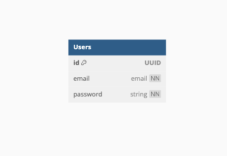

# Infograb 백엔드 채용 테스트

## 서비스 주소

- http://1.227.114.115:3002/login
- 발표 자료 : [Notion](https://hangjo0610.notion.site/NestJS-Lifecycle-df66a76c2d8249a3bd8ca4efa16a3449?pvs=4)

## 요구사항

- 계정 로그인, 로그아웃이 가능한 프로젝트
- 타입스크립트 사용
- README 작성
- Swagger 작성
- `Passport JWT`와 `Passport local`을 사용하여 계정 인증

## 사용 기술 스택

`NestJS`, `PostgreSQL`, `TypeORM`, `bcrypt`, `Passport`, `JWT`, `Swagger`

## ERD

- ID : UUID 형태로 구성
- email : email 형식으로 회원 관리 진행
- Password : String 형태

## API

API 명세서 : http://1.227.114.115:3002/docs

- `/login` [GET]: 로그인 화면이 나오는 HTML 페이지 리턴
- `/login` [POST]: 로그인 요청
- `/logout` [POST]: 로그아웃 요청
- `/signup` [POST]: 회원가입 요청
